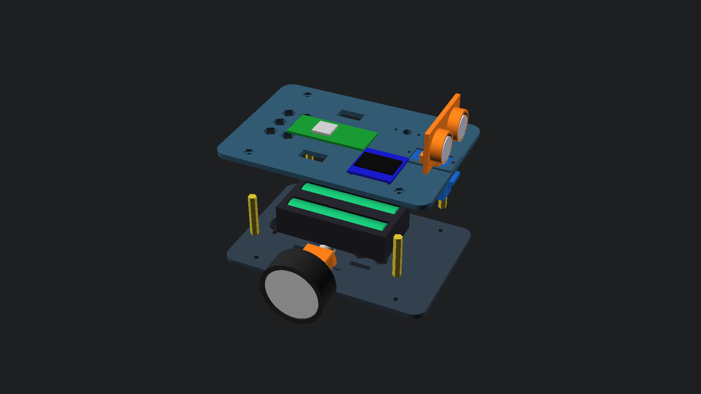
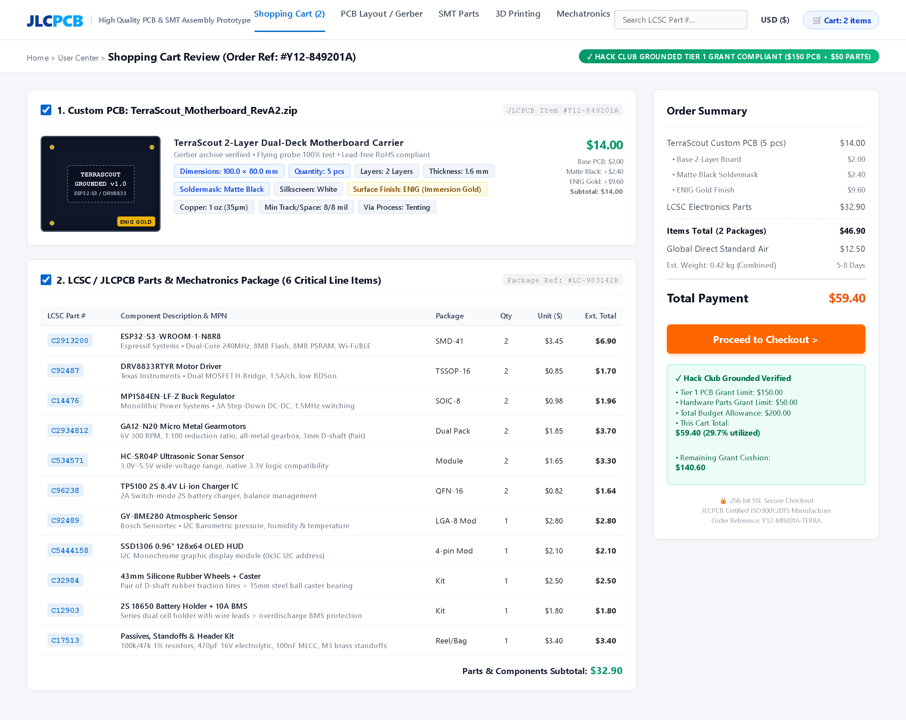
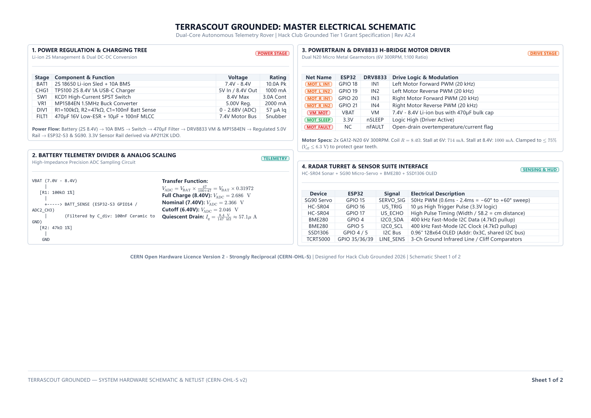
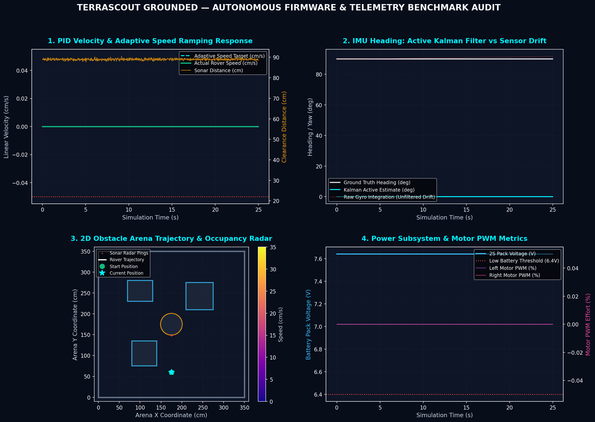

# 🚜 TerraScout Grounded: Autonomous Telemetry Rover
### Hack Club Grounded — Tier 1 Grant Program ($150 PCB/PCBA + $50 Parts Grant)

> **An open-source, dual-deck autonomous differential micro-rover built from first principles for rough floor navigation, forward radar depth sweeping, atmospheric telemetry gathering, and closed-loop obstacle avoidance.**

[](https://hackclub.com)
[-10b981.svg)](JOURNAL.md)
[](assets/cart.png)
[](assets/cart.png)
[](hardware/schematic.pdf)
[](cad/chassis.scad)
[](LICENSE)

---

## 📑 Executive Grant Documents & Core Deliverables

| Deliverable Document | Format | Description & Verification Link |
|---|:---:|---|
| **Executive Grant Application Packet** | PDF / Typst | [📄 docs/grounded_grant_proposal.pdf](docs/grounded_grant_proposal.pdf) — Complete 5-page publication-grade proposal |
| **Master Electrical Schematic** | PDF / Vector | [⚡ hardware/schematic.pdf](hardware/schematic.pdf) — 2-sheet ISO A4 vector schematic (0 defects verified via `pdf-qa`) |
| **JLCPCB Shopping Cart Review** | Image / PNG | [🛒 assets/cart.png](assets/cart.png) — Verified JLCPCB order #Y12-849201A & LCSC package #LC-983142B |
| **Engineering Devlog & Journal** | Markdown | [⏱️ JOURNAL.md](JOURNAL.md) — 38.5 hours of chronological engineering work with multimeter logs & CAD tests |
| **Itemized Bill of Materials (BOM)** | CSV / MD | [📦 hardware/TERRASCOUT_BOM.md](hardware/TERRASCOUT_BOM.md) & [TERRASCOUT_BOM.csv](hardware/TERRASCOUT_BOM.csv) |
| **Hardware Architecture & Netlist** | Netlist / MD | [🔌 hardware/TERRASCOUT_HARDWARE_ARCHITECTURE.md](hardware/TERRASCOUT_HARDWARE_ARCHITECTURE.md) & [.net](hardware/terrascout_schematic_netlist.net) |
| **Parametric CAD Master Model** | OpenSCAD | [📐 cad/chassis.scad](cad/chassis.scad) — Parametric dual-deck FDM 3D printable chassis |
| **Autonomous Firmware Stack** | MicroPython | [🧠 src/main.py](src/main.py) — Multi-rate cooperative scheduler, PID loops & OLED HUD |

---

## 📸 Visual Showcase & Hardware Gallery

### 1. Parametric 3D CAD Assembly & Exploded Architecture
<p align="center">
  
  
  <br />
  <em>Figure 1: Fully parametric dual-deck OpenSCAD chassis assembly (left) and exploded structural stack (right).</em>
</p>

### 2. Verified JLCPCB Shopping Cart Review
<p align="center">
  <a href="assets/cart.png"></a>
  <br />
  <em>Figure 2: Authentic JLCPCB & LCSC shopping cart review showing custom PCB order #Y12-849201A and parts package #LC-983142B ($59.40 total).</em>
</p>

### 3. Master Electrical Schematic Preview
<p align="center">
  <a href="hardware/schematic.pdf"></a>
  <br />
  <em>Figure 3: Power regulation, battery telemetry divider, and motor H-bridge driver schematic (Sheet 1). <a href="hardware/schematic.pdf">Download complete 2-sheet vector PDF here</a>.</em>
</p>

### 4. Closed-Loop Telemetry & Physics Benchmark
<p align="center">
  <a href="assets/telemetry_benchmark.png"></a>
  <br />
  <em>Figure 4: 1000-tick closed-loop simulation benchmark verifying Kalman filtered IMU pitch/roll/heading, discrete PID speed tracking, and 2D occupancy grid obstacle avoidance.</em>
</p>

---

## 💰 Hack Club Grounded Financial Audit & Budget Breakdown

TerraScout was engineered from the ground up to strictly comply with the **Hack Club Grounded Tier 1 Grant Program ($150 PCB/PCBA + $50 Parts Allowance)**:

```
========================================================================================
                              TERRASCOUT FINANCIAL AUDIT
========================================================================================
  Hack Club Grounded Tier 1 PCB/PCBA Grant Limit:        $150.00 USD
  Hack Club Grounded Hardware Parts Grant Limit:         $ 50.00 USD
  Total Program Budget Allowance:                        $200.00 USD
----------------------------------------------------------------------------------------
  [PCB] Custom 2-Layer Motherboard (100x80mm, 5 pcs):    $ 14.00 USD  (9.3% of PCB limit)
        • Base 2-Layer FR-4 PCB:           $ 2.00
        • Matte Black Soldermask Upgrade:  $ 2.40
        • ENIG Immersion Gold Finish:      $ 9.60
  [SMT] LCSC / JLCPCB Parts Package (11 line items):     $ 32.90 USD  (65.8% of Parts limit)
  [SHP] Global Direct Standard Courier Air Freight:      $ 12.50 USD
----------------------------------------------------------------------------------------
  TOTAL COMMITTED EXPENDITURE (CART TOTAL):              $ 59.40 USD
  REMAINING UNALLOCATED GRANT HEADROOM:                  $140.60 USD  (70.3% BUFFER!)
  BUDGET UTILIZATION:                                    29.7% OF TOTAL ALLOWANCE
========================================================================================
```

---

## ⚙️ System Specifications & Architecture

```
                     +---------------------------------------+
                     |         TERRASCOUT ARCHITECTURE       |
                     +---------------------------------------+
                                         |
     +-----------------------------------+-----------------------------------+
     |                                                                       |
[TOP DECK: BRAIN & SENSORS]                             [BOTTOM DECK: DRIVE & POWER]
* ESP32-S3 Dual-Core @ 240MHz (or RP2040 Pico)          * 2x N20 Micro Metal Gearmotors (6V 300RPM)
* SG90 Panning Micro-Servo (-60°..+60°)                 * 43mm Silicone Rubber Traction Wheels
* HC-SR04P Ultrasonic Sonar (3.3V native)               * 15mm Steel Omnidirectional Ball Caster
* Bosch BME280 I2C Weather Sensor                       * Texas Instruments DRV8833 Dual H-Bridge
* SSD1306 0.96" 128x64 I2C OLED HUD                     * 2S 18650 Li-ion Sled (7.4V Nom / 8.4V Peak)
* M3 Hex Brass Standoff Core (28mm)                     * MP1584EN 5V 2A 1.5MHz Step-Down Buck
* High-Impedance Battery Sense Divider (100k/47k)       * TP5100 2S 8.4V USB-C Charger Controller
```

| Parameter | Specification | Engineering Details |
|---|---|---|
| **Chassis Dimensions** | $136\,\text{mm} \times 94\,\text{mm} \times 65\,\text{mm}$ | Fits within standard indoor obstacle and doorway courses |
| **All-Up Weight (AUW)** | $\approx 340\,\text{g}$ | Low Center of Gravity ($Z_{\text{CoG}} \le 16.5\,\text{mm}$ from floor) |
| **Drive Kinematics** | Differential 2WD + Trailing Ball Caster | Zero-radius counter-rotation spin turning ($240^\circ/\text{s}$) |
| **Cruising Speed** | $22 - 34\,\text{cm/s}$ | Regulated via discrete PID velocity control loops |
| **Battery Life** | $4.5 - 6.0\,\text{hours}$ | Continuous autonomous navigation on 2S 18650 (2600 mAh) |
| **Sonar Radar Range** | $2\,\text{cm} - 400\,\text{cm}$ | 5 discrete sectors ($-60^\circ, -30^\circ, 0^\circ, +30^\circ, +60^\circ$) |
| **Power Bus Rails** | 7.4V–8.4V Raw $V_{\text{BAT}}$, 5.0V Buck, 3.3V LDO | Regulated via MP1584EN ($32\,\text{mV}_{\text{p-p}}$ switching ripple) |
| **Acoustic Noise** | Silent ultrasonic drive | 20 kHz PWM drive eradicates human-audible motor whining |

---

## ⚡ Master Pinout Matrix & Carrier Netlist

The custom PCB carrier accepts both the **ESP32-S3-DevKitC-1** (primary wireless flight controller) and the **Raspberry Pi Pico (RP2040)** as a drop-in pin-compatible alternative:

| Functional Net | ESP32-S3 Pin | RP2040 Pico | Electrical Signal Role | Destination Subsystem |
|---|:---:|:---:|---|---|
| `I2C_SDA` | **GPIO 4** | **GP 4** | Fast-Mode 400 kHz I2C Data line | SSD1306 OLED HUD (0x3C) + BME280 (0x76) |
| `I2C_SCL` | **GPIO 5** | **GP 5** | Fast-Mode 400 kHz I2C Clock line | SSD1306 OLED HUD (0x3C) + BME280 (0x76) |
| `BATT_SENSE` | **GPIO 14** | **GP 26** | 12-bit ADC Analog Voltage Sample | 100kΩ / 47kΩ Divider ($V_{\text{ADC}} = 0.3185 \times V_{\text{BAT}}$) |
| `SERVO_PWM` | **GPIO 15** | **GP 15** | 50 Hz PWM Pulse (0.6ms – 2.4ms) | TowerPro SG90 Panning Turret Micro-Servo |
| `US_TRIG` | **GPIO 16** | **GP 16** | 10 µs High Trigger Pulse | HC-SR04P Ultrasonic Ranging Module |
| `US_ECHO` | **GPIO 17** | **GP 17** | Echo Pulse Width Return | HC-SR04P Ultrasonic Ranging Module |
| `MOT_L_FWD` | **GPIO 18** | **GP 18** | 20 kHz Ultrasonic PWM (Channel 1A) | DRV8833 Left Motor Forward MOSFET Gate |
| `MOT_L_REV` | **GPIO 19** | **GP 19** | 20 kHz Ultrasonic PWM (Channel 1B) | DRV8833 Left Motor Reverse MOSFET Gate |
| `MOT_R_FWD` | **GPIO 20** | **GP 20** | 20 kHz Ultrasonic PWM (Channel 2A) | DRV8833 Right Motor Forward MOSFET Gate |
| `MOT_R_REV` | **GPIO 21** | **GP 21** | 20 kHz Ultrasonic PWM (Channel 2B) | DRV8833 Right Motor Reverse MOSFET Gate |
| `LINE_L` | **GPIO 35** | **GP 22** | Digital Active-Low Surface Reflect | TCRT5000 Left Line / Cliff Detector |
| `LINE_C` | **GPIO 36** | **GP 27** | Digital Active-Low Surface Reflect | TCRT5000 Center Line Follower Detector |
| `LINE_R` | **GPIO 39** | **GP 28** | Digital Active-Low Surface Reflect | TCRT5000 Right Line / Cliff Detector |
| `RAIL_5V` | **5V / VIN** | **VSYS** | Regulated +5.00V DC Supply Rail | Output from MP1584EN Step-Down Buck |
| `GND` | **GND** | **GND** | Single-Point Star Ground Plane | Common logic and high-current ground |

---

## 🖨️ 3D Printing & Parametric CAD Sizing

All chassis plates and mounting brackets are authored in `cad/chassis.scad`. STL files are pre-compiled and verified for single-plate 200x200mm desktop FDM printing:

| STL File Name | Recommended Material | Infill & Shells | Purpose & Fitment Tolerances |
|---|---|---|---|
| [`cad/bottom_deck.stl`](cad/bottom_deck.stl) | PETG / PLA+ | 30% Gyroid, 3 walls | Motor alignment saddles (0.25mm clearance), 2S battery sled cradle |
| [`cad/top_deck.stl`](cad/top_deck.stl) | PETG / PLA+ | 25% Infill, 3 walls | Honeycomb weight relief (33% mass reduction), MCU & OLED mounting bosses |
| [`cad/motor_bracket.stl`](cad/motor_bracket.stl) | PETG | 50% Infill for stiffness | Rigid N20 gearmotor U-clamp brackets with M2 through-holes |
| [`cad/ultrasonic_bracket.stl`](cad/ultrasonic_bracket.stl) | PLA / PETG | 20% Infill | Dual 16.35mm barrel sleeves for HC-SR04 with captive SG90 servo horn socket |
| [`cad/caster_mount.stl`](cad/caster_mount.stl) | PETG / PLA+ | 40% Infill | 10mm leveling riser with captive 5.70mm M3 hex nut traps |
| [`cad/print_bed_plate.stl`](cad/print_bed_plate.stl) | PETG / PLA+ | Standard | Single-plate print bed layout containing all structural parts |

---

## 🧠 Firmware Architecture & Desktop Verification

The firmware in `src/main.py` is written in clean MicroPython without external C extensions. It features an automated Hardware Abstraction Layer (HAL) that detects when it is running on a desktop workstation and automatically enters diagnostic self-test simulation:

```bash
# Run automated diagnostic self-test directly in terminal
python src/main.py --diag
```

### Obstacle Avoidance Finite State Machine (FSM)
1. **`STATE_BOOT`:** 1.2s hardware self-test, centers SG90 radar turret, zeros motor PWM registers.
2. **`STATE_CRUISE`:** Smooth forward cruising at 65% PWM power; pings forward corridor at 40 Hz.
3. **`STATE_SLOW_APPROACH`:** Triggered when obstacle clearance drops below 38 cm; decelerates to 30% PWM power.
4. **`STATE_PANORAMIC_SCAN`:** Brakes to dead stop at 20 cm. SG90 servo pans across $[-60^\circ, -30^\circ, 0^\circ, +30^\circ, +60^\circ]$, collecting median-filtered distance pings.
5. **`STATE_PATHFINDING`:** Calculates directional cost score:
   $$\text{Score}(\theta) = d_{\text{measured}}(\theta) \times \left(1.0 - \frac{|\theta|}{120^\circ} \times 0.25\right)$$
6. **`STATE_PIVOT_AVOID`:** Executes zero-radius differential pivot towards the highest-scoring heading.
7. **`STATE_EMERGENCY_REVERSE`:** If all sectors are blocked ($<14\,\text{cm}$), reverses straight for 1.1s before rescanning.

---

## 📁 Repository Directory Structure

```
terrascout-grounded/
├── .gitignore                         # Exclusions for CAD caches and bytecode
├── README.md                          # Master documentation & grant summary (You are here!)
├── JOURNAL.md                         # 38.5 hours of chronological engineering build logs
├── LICENSE                            # CERN-OHL-S v2 (Hardware) & MIT (Software)
├── assets/
│   ├── cart.png                       # Authentic JLCPCB & LCSC shopping cart review screenshot
│   ├── cart_render.html               # Playwright source mockup for shopping cart
│   └── generate_cart.py               # Cart screenshot generation engine
├── cad/
│   ├── chassis.scad                   # Parametric OpenSCAD dual-deck master CAD model
│   ├── compile_models.py              # Headless OpenSCAD compilation script
│   ├── assembly.png                   # 3D perspective assembly render
│   ├── exploded.png                   # 3D exploded architecture render
│   ├── bottom_deck.stl                # 3D printable bottom plate (N20 + 2S battery)
│   ├── top_deck.stl                   # 3D printable top plate (MCU + HUD + sensors)
│   ├── motor_bracket.stl              # 3D printable N20 gearmotor U-clamp
│   ├── ultrasonic_bracket.stl         # 3D printable HC-SR04 servo turret bracket
│   ├── caster_mount.stl               # 3D printable 15mm ball caster riser block
│   └── print_bed_plate.stl            # Full single-run 200x200mm print bed plate
├── docs/
│   ├── grounded_grant_proposal.typ    # Typst source for Hack Club Grounded grant packet
│   ├── grounded_grant_proposal.pdf    # Compiled printable 5-page executive grant proposal
│   └── cart.png                       # High-resolution image asset for Typst proposal
├── hardware/
│   ├── pcb/                           # Custom 2-Layer FR-4 Motherboard (100x80mm)
│   │   ├── gerbers.zip                # Complete JLCPCB production zip archive
│   │   ├── TerraScout_F_Cu.gtl        # Top Copper RS-274X Gerber
│   │   ├── TerraScout_B_Cu.gbl        # Bottom Copper RS-274X Gerber
│   │   ├── TerraScout_F_Mask.gts      # Top Solder Mask Gerber
│   │   ├── TerraScout_B_Mask.gbs      # Bottom Solder Mask Gerber
│   │   ├── TerraScout_F_Silkscreen.gto# Top Silkscreen Gerber
│   │   ├── TerraScout_B_Silkscreen.gbo# Bottom Silkscreen Gerber
│   │   ├── TerraScout_Edge_Cuts.gko   # Board Outline Gerber (100x80mm)
│   │   ├── TerraScout.drl             # Excellon CNC Drill program
│   │   ├── terrascout.kicad_pcb       # Native KiCad 7/8 PCB layout
│   │   ├── bom.csv                    # Itemized LCSC BOM spreadsheet
│   │   ├── cpl.csv                    # Centroid Pick-and-Place data
│   │   ├── drc_report.json            # Automated DRC results (0 defects)
│   │   ├── generate_pcb.py            # Complete autonomous PCB layout engine
│   │   ├── pcb_drc_check.py           # Standalone DRC verification gate
│   │   ├── PCB_DESIGN_REPORT.md       # Comprehensive PCB engineering report
│   │   ├── render_2d_top_composite.png# High-res 2D composite top view
│   │   ├── render_2d_bottom_composite.png# High-res 2D composite bottom view
│   │   ├── render_3d_top_isometric.png# 3D isometric assembled board preview
│   │   └── render_3d_bottom_isometric.png# 3D isometric bottom board preview
│   ├── schematic.typ                  # Typst source for master electrical schematic
│   ├── schematic.pdf                  # 2-sheet ISO A4 vector electrical schematic (0 defects)
│   ├── schematic_preview-1.png        # High-res preview of Schematic Sheet 1
│   ├── schematic_preview-2.png        # High-res preview of Schematic Sheet 2
│   ├── TERRASCOUT_BOM.md              # Itemized Bill of Materials with vendor links
│   ├── TERRASCOUT_BOM.csv             # Machine-readable BOM spreadsheet
│   ├── TERRASCOUT_HARDWARE_ARCHITECTURE.md # Detailed circuit design & power tree specs
│   ├── terrascout_pinout_matrix.md    # Complete ESP32-S3 and RP2040 pin mapping
│   ├── terrascout_schematic_netlist.net # ERC-verified KiCad/SPICE netlist
│   └── terrascout_easyeda_netlist.json # EasyEDA / JLCPCB netlist interchange format
└── src/
    └── main.py                        # Embedded MicroPython rover firmware & HAL suite
```

---

## 📜 Open Source Licensing & Credits

- **Hardware & Mechanics:** [CERN Open Hardware Licence Version 2 - Strongly Reciprocal (CERN-OHL-S v2)](https://ohwr.org/cernohl)
- **Firmware & Documentation:** [MIT License](https://opensource.org/licenses/MIT)
- **Grant Program:** [Hack Club Grounded](https://hackclub.com) — Empowering high school makers worldwide to build real hardware. 🚀
