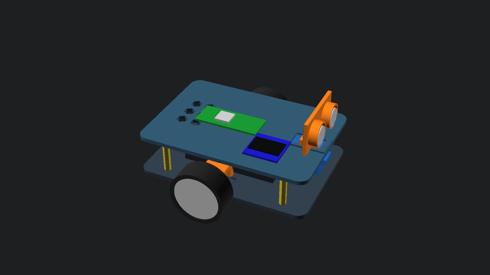
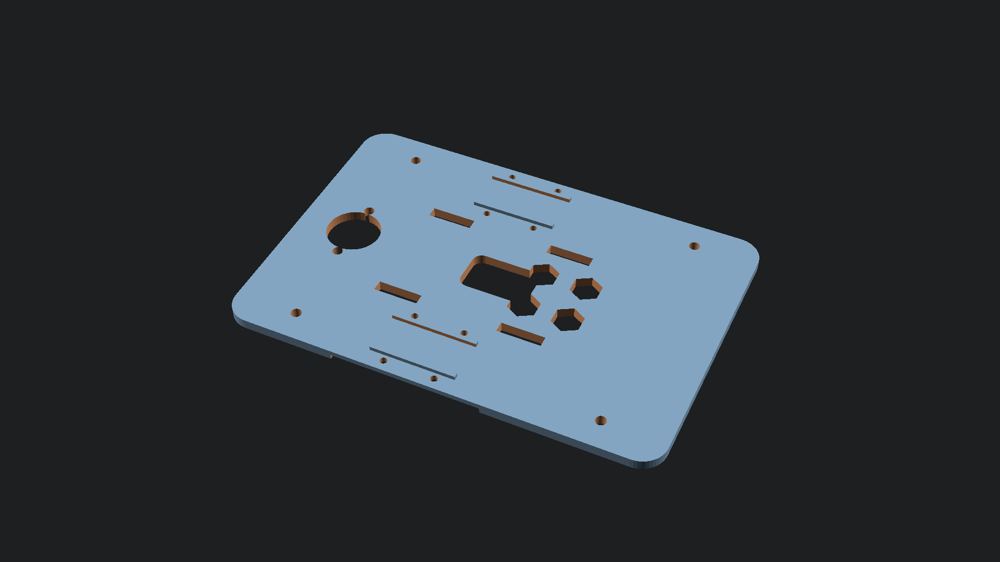
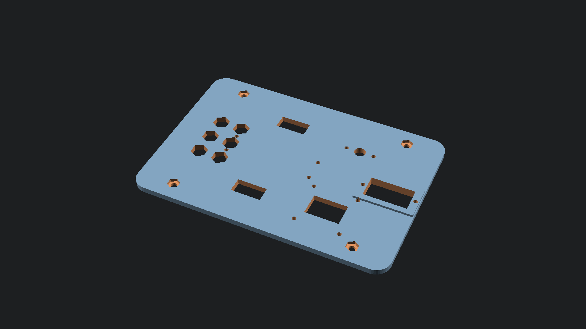
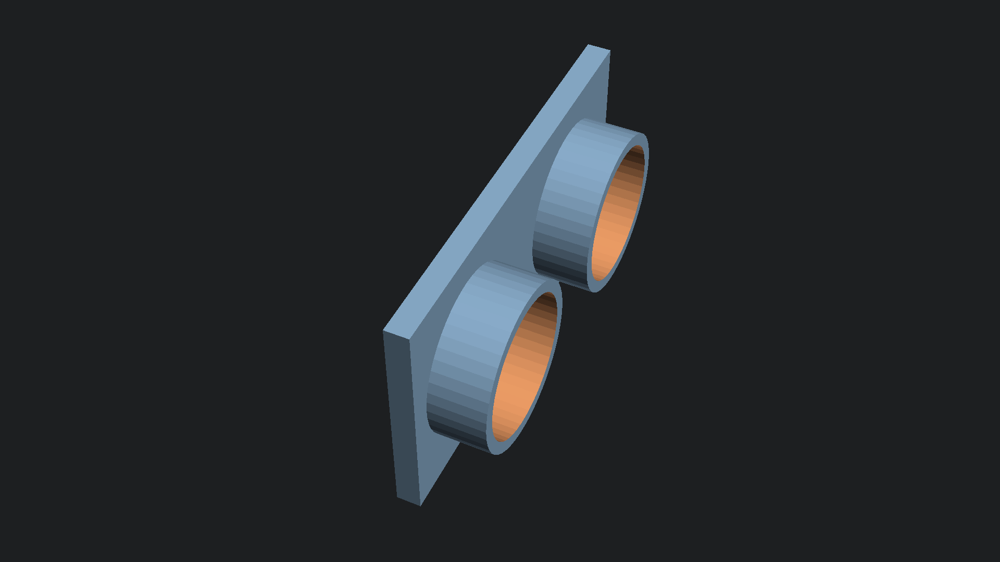

# TerraScout Rover — Parametric Dual-Deck Chassis & CAD Suite



A high-rigidity, modular dual-deck differential rover chassis engineered in **OpenSCAD** for the **TerraScout Grounded Telemetry Rover** platform.

---

## 1. Mechanical Architecture & Specifications

The TerraScout chassis employs a stacked dual-deck architecture connected by four precision M3 brass standoffs, establishing an isolated lower power/propulsion deck and an upper sensor/compute avionics deck.

| Parameter | CAD Specification | Hardware Target / Mating Component | Clearance / Tolerance |
| :--- | :--- | :--- | :--- |
| **Deck Dimensions** | **136.0 × 94.0 × 3.2 mm** | Precision CNC / 3D printed plate | Filleted 8.0 mm safety corner radii |
| **Inter-Deck Clearance** | **28.0 mm vertical span** | 4× M3 × 28mm hex brass standoffs | 8.5 mm overhead clearance above battery |
| **Standoff Pattern** | **96.0 × 76.0 mm span** | M3 screws through Ø3.3 mm holes | 0.30 mm diametral ISO slip fit |
| **Drive Motors** | **2× N20 Metal Gearmotors** | 6V 300 RPM micro metal gearmotors | Dual-saddle 0.20 mm compression clamp |
| **Motor Fasteners** | **4× M2 × 14mm socket screws** | Ø2.2 mm holes with 4.2mm counterbores | Positive thread engagement into chassis |
| **Drive Wheels** | **43.0 mm OD × 18.0 mm wide** | High-traction rubber tread tires | 2.0 mm radial tire clearance cutouts |
| **Rear Ground Support** | **15 mm Steel Ball Caster** | Riser standoff block with M3 nut traps | 10.0 mm height for level 3-point stance |
| **Power Subsystem** | **2S 18650 Battery Sled** | Dual 18650 cells (7.4V 2600-3500mAh) | 4× zip-tie slots (14×3.5mm) on 40mm span |
| **Compute & Avionics** | **Raspberry Pi Pico / ESP32** | 51.0 × 21.0 mm MCU plate | M2 mounting holes at 47.0 × 11.4 mm |
| **HUD Telemetry** | **0.96" SSD1306 OLED** | 27.0 × 27.0 mm display module | 23.5 × 23.5 mm M2 hole pattern + slot |
| **Environmental Sensor**| **Bosch BME280 Module** | I2C temp/humidity/pressure sensor | 15.0 mm M2 hole spacing + 6mm air vent |
| **Obstacle Avoidance** | **HC-SR04 / RCWL-1601** | Dual 16.0 mm ultrasonic barrels | Ø16.3 mm press-fit sleeves (0.15mm margin) |
| **Turret Actuator** | **SG90 9g Micro Servo** | Panning forward prow mount | 23.0 × 12.4 mm slot with M2 flange ears |

---

## 2. Multi-Tier Exploded Architecture


The physical stack separates cleanly into five functional tiers:
1. **Ultrasonic Sensor Turret**: Dual-barrel press-fit eye bracket mounted directly to the SG90 servo output horn.
2. **Top Avionics Deck (`cad/top_deck.stl`)**: Houses the forward SG90 panning servo boss, Raspberry Pi Pico MCU mounts, SSD1306 OLED HUD cutout, BME280 air-sampling port, and hexagonal rear ventilation lattice.
3. **M3 Structural Standoffs**: Four 28mm hex brass pillars creating an isolated 28mm vertical avionics bay.
4. **2S 18650 Battery Sled & Power Distribution**: Dual-cell Li-ion sled cradled in the center of the bottom deck and secured through four slotted tie-down anchors.
5. **Bottom Propulsion Deck (`cad/bottom_deck.stl`)**: Houses dual N20 gearmotor cradles, heavy-duty M2 clamping brackets (`cad/motor_bracket.stl`), drive wheel cutouts, central wiring conduit, and the rear ball caster riser (`cad/caster_mount.stl`).

---

## 3. High-Resolution Visual Inspection Gallery

### Bottom Deck Chassis Plate

- Features integrated N20 motor alignment saddles, 4× zip-tie retention slots for the 18650 battery sled, lateral tire clearance cutouts, and central wiring passthrough.

### Top Deck Electronics Plate

- Features reinforced forward panning servo ears, Raspberry Pi Pico mounting pattern, OLED display window, BME280 sensor port, and hexagonal heat-dissipation lattice.

### Ultrasonic Panning Turret Bracket

- Dual 16.3mm cylindrical retention barrels with rear crystal oscillator clearance pocket and lower SG90 servo horn receiver.

---

## 4. 3D Printing & Manufacturing Guidelines

All models are engineered to print with **zero supports** when oriented correctly:

| Part Name | File Name | Print Orientation | Recommended Layer Height | Infill |
| :--- | :--- | :--- | :--- | :--- |
| **Bottom Deck** | `bottom_deck.stl` | Flat on build plate (Z=0) | 0.20 mm | 30% Gyroid |
| **Top Deck** | `top_deck.stl` | Flat on build plate (Z=0) | 0.20 mm | 30% Gyroid |
| **N20 Bracket (2x)** | `motor_bracket.stl`| Flat on base face | 0.16 mm | 50% Rectilinear |
| **Caster Mount** | `caster_mount.stl` | Flat on bottom face | 0.16 mm | 40% Gyroid |
| **Turret Bracket** | `ultrasonic_bracket.stl` | Flat on rear sensor face | 0.16 mm | 30% Gyroid |
| **Full Print Bed** | `print_bed_plate.stl` | Single batch (200×200mm bed)| 0.20 mm | 30% Gyroid |

---

## 5. Automated Build Pipeline

To compile all models into watertight binary STLs, generate 1080p renders, and run the topological manifoldness and clearance audit:

```bash
python cad/compile_models.py
```
